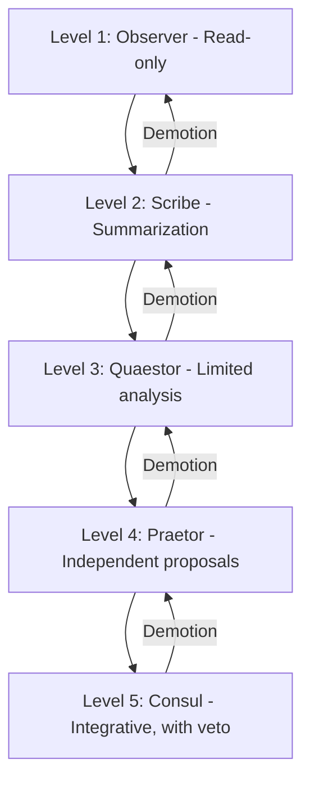
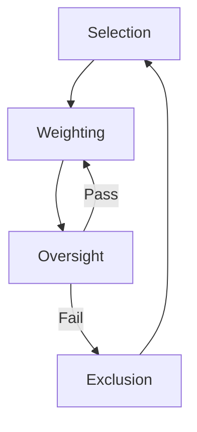

<DOCUMENT filename="06_Senate_Thinking_final_corrected_v8.md">
# Senate Thinking: Positioning AI in the Assembly of Human Knowledge

**Author:** Torisan Unya (ORCID: https://orcid.org/0009-0004-7067-9765)  
**Affiliation:** Independent Researcher  
**Keywords:** Human-AI Collaboration, Senate Metaphor, Historical Analogy, Knowledge Integration, World-Systems Theory, Polyphony, First Principles, Conceptual Lexicon, Epistemological Implications  
**arXiv Categories:** cs.HC; cs.AI; cs.CY  

**arXiv Submission Note:** v25: To enhance its potential as a foundational text, this version introduces a 'conceptual map' in the introduction, expands the glossary into a lexicon, and explicitly frames the diverse historical examples as a polyphonic collection. The conclusion now emphasizes the four core principles and poses open questions for future generations, aiming for classical durability. Conceptual analysis only (October 04, 2025).  

---

### Plain-Language Summary (For Technologists)
**Subject:** This paper proposes a conceptual framework called "Senate Thinking" for integrating AI into complex human knowledge domains, treating AI not as a mere tool but as a governed participant.  
**Problem:** As AI capabilities grow, we lack a robust model for collaboration beyond simple task automation. How do we leverage AI's analytical power in high-stakes intellectual work (like research, legal analysis, or strategic planning) without compromising human oversight, accountability, and epistemic integrity?  
**Proposal:** We model humanity's collective knowledge as a "Senate"—a deliberative body. AI is a candidate for admission, subject to strict rules. The framework outlines a staged integration process:  
1. **Consultative Resource:** AI provides data and analysis, like an external expert.  
2. **Auxiliary Participant:** AI assists in tasks like peer review or synthesis, with its contributions clearly labeled and scrutinized.  
3. **Deliberative Contributor (with Veto):** AI can propose novel connections or syntheses, but all outputs are subject to final human judgment and veto.  
**Key Principles for Implementation:** This model is built on four operational principles applicable to system design:  
* **Selection:** AI contributions must be verifiable, with traceable origins (explainability).  
* **Weighting:** The influence of an AI's output is weighted based on its provenance and validation status. This is inspired by historical commercial networks like the Dutch East India Company, which had to manage trust in information from decentralized agents.
* **Oversight:** Human-led committees or auditors must have the right to inspect AI's reasoning.  
* **Exclusion:** Clear protocols must exist for retracting or correcting AI-generated errors.  
**Why it Matters for Technologists:** "Senate Thinking" provides a human-centered governance model that translates directly into system requirements for building trustworthy and accountable AI. It offers a blueprint for designing human-AI interaction in a way that manages risks (e.g., misinformation, bias) while maximizing the benefits of machine intelligence, aligning with frameworks like the NIST AI RMF and the EU AI Act.  
For a complementary perspective emphasizing the historical and philosophical dimensions of this framework, see the Plain-Language Summary for Humanists below.

### Plain-Language Summary (For Humanists)
**Subject:** This paper presents a thought experiment, "Senate Thinking," to explore how artificial intelligence might be positioned within the long tradition of human knowledge and intellectual deliberation.  
**The Central Question:** If we imagine the entirety of human intellectual heritage—from Plato to postcolonial theory—as a great deliberative assembly, akin to the Roman Senate, what role could or should AI play? Is it an outside invader, a passive library, or something more?  
**Our Metaphorical Framework:** We propose viewing AI as a "candidate" for inclusion in this "Senate of Knowledge." This is not to grant AI rights or agency, but to use a historical analogy to structure our thinking. We draw primarily from the Roman debate over admitting Gallic elites into the Senate in 48 CE. This event encapsulates the timeless tension between enriching a tradition with new perspectives and the fear of diluting its integrity or "barbarizing" it.  
**Critical & Historical Dimensions (A Polyphonic Approach):** This paper is intentionally structured as a **polyphonic (multi-voiced) collection of sources** to ensure interpretive depth. The Roman metaphor is a central theme, but it is critically examined alongside other models:
* **Economic History:** The Dutch East India Company (VOC)'s challenge of governing uncertain information across a global network provides a powerful real-world precedent for managing AI's contributions today.
* **Non-Western Governance:** The Haudenosaunee (Iroquois) Confederacy's consensus-building and seven-generation foresight offers a crucial, non-hierarchical alternative to the Roman model.
* **World-Systems Theory:** We apply Immanuel Wallerstein's theory to frame AI integration as a power dynamic between a knowledge "core" (human institutions) and a new "periphery" (AI) providing analytical labor, warning against "epistemic colonialism."
* **Other Precedents:** China's Imperial Examinations, the Islamic Golden Age's translation houses, and the Royal Society's principles of verification further enrich the analysis.
**Epistemological Implications:** The paper examines how AI could alter our scholarly practices—in textual collation, translation, or archival research—and what **four core principles** of oversight (Selection, Weighting, Oversight, Exclusion) are needed to ensure AI serves, rather than dominates, humanistic inquiry.  
**Why it Matters for Humanists:** "Senate Thinking" is a call for the humanities to take a leading role in shaping our relationship with AI. It offers a historically and philosophically grounded framework for reflecting on whether—and how—this new technology can be integrated into our epistemic practices in a way that is ethical, accountable, and intellectually rigorous. It urges us not to be passive consumers of technology, but active judges of its value, and leaves open fundamental questions for future generations to debate.  
For a complementary perspective emphasizing the technical and operational dimensions of this framework, see the Plain-Language Summary for Technologists above.

## Abstract

This position paper conceptualizes humanity's intellectual heritage as a metaphorical "Senate"—a deliberative assembly of accumulated wisdom—and examines how artificial intelligence (AI) might be positioned within it. We treat AI not as a tool or rival, but as a candidate for judicious inclusion, without implying agency or rights. The paper is structured as a **polyphonic** inquiry, placing the primary analogy of Roman senatorial expansion in critical dialogue with a wide range of historical precedents, including the governance of early modern commercial networks (VOC), China's Imperial Examinations, and the Haudenosaunee Confederacy's Great Law of Peace. This analysis is critically sharpened by applying Immanuel Wallerstein's **World-Systems Theory**, which frames the integration as a potential power dynamic between a knowledge "core" and an AI "periphery." From this multi-vocal exploration, we distill **four first principles** for AI integration: **Selection, Weighting, Oversight, and Exclusion**, all under strict human-centered governance. The paper acknowledges the risks of such integration, such as epistemic dependency, and tempers the primary Roman metaphor with postcolonial critiques and alternative, non-hierarchical deliberative models. Ultimately, this work serves not as a final verdict, but as a foundational text that poses open questions for future generations, calling for sustained scholarly judgment on how AI can enhance epistemic endeavors in alignment with established ethical frameworks.

---

## 1. Introduction: A Conceptual Map for a Polyphonic Inquiry

The plain-language summaries above target two different scholarly communities, bridging technical and humanistic perspectives to foster interdisciplinary dialogue on AI's epistemic role. Humanity's intellectual heritage—from philosophical treatises to scientific paradigms—forms a collective assembly of wisdom, akin to a deliberative body where diverse voices shape decisions. This position paper introduces "Senate Thinking" as a framework for positioning artificial intelligence (AI) within this assembly. We conceptualize AI not as an invader or mere repository but as a potential contributor to deliberation, subject to rigorous human oversight.

This paper is intentionally structured as a **polyphonic collection of historical and philosophical precedents**. While the Roman Senate serves as our primary metaphor, it is not presented as a singular, ideal model. Rather, it acts as a central axis around which a constellation of other case studies—from the economic governance of the Dutch East India Company (VOC) to the consensus-based councils of the Haudenosaunee Confederacy and the knowledge curation of the Encyclopédistes—are arranged. This introduction provides a **conceptual map** to this diverse landscape, guiding the reader through a multi-faceted inquiry designed to illuminate the central problem from various angles. The aim is not to offer a single solution, but to build a rich, multi-layered framework for reflection, much like a classical text that invites interpretation from future generations.

This conceptualization of knowledge as an "assembly" draws on philosophical traditions of collective inquiry, but we acknowledge its limits: it may imply a harmonious unity that overlooks power dynamics (as in Foucault's knowledge-power nexus [86], [87]) or gender exclusions in historical assemblies (as critiqued in feminist epistemology [88], [89]). The metaphor operates on three layers: (1) AI as a consultative resource (peripheral augmentation); (2) AI as an auxiliary participant (providing insights under scrutiny); (3) AI in deliberative participation (contributing to synthesis, but with human veto as the final authority). Normative criteria guide this: human judgment remains inalienable; all contributions require disclosure of origins and reasoning; participation is proxy-based, with human guarantors ensuring accountability.

Inspired by Roman expansions of senatorial inclusion—notably Claudius's admission of Gallic elites in 48 CE—we explore implications while addressing the metaphor's imperial connotations. This central analogy is enriched and critiqued by a chorus of others: the Encyclopédistes' knowledge democratization, Meirokusha's strategic reception of foreign ideas, Buddhist councils' doctrinal compilation, Incan Quipu's non-textual governance, Indian Śāstrārtha's adversarial debates, West African Griot's embodied archives, Polynesian wayfinding's embodied expertise, Japanese dual power's separation of legitimacy and execution, the Mongol empire's standardized protocols, and the Haudenosaunee Confederacy's Great Law of Peace for intergenerational governance. As an independent researcher, this perspective bridges humanities and technology through detached inquiry.

The paper does not endorse uncritical integration but calls for scholarly judgment. Section 2 outlines methodology; Section 3 reviews precedents; Section 4 elaborates the proposal with its operational principles; Section 5 analyzes the Roman analogy; Section 6 discusses implications with examples; Section 7 concludes by emphasizing the core principles and posing open questions for the future.

---

## 2. Methodology

This paper employs a combination of reflective equilibrium (balancing intuitions and principles for normative coherence), conceptual engineering (refining metaphors to clarify epistemic practices), and comparative history (drawing analogies across civilizations to identify patterns in knowledge governance). Reflective equilibrium ensures the metaphor aligns with ethical intuitions, such as preserving human primacy. Conceptual engineering sharpens terms like "inclusion" to avoid anthropomorphism. Comparative history extracts principles (e.g., merit-based selection from Keju) while critiquing biases, forming the basis of our polyphonic approach.

Normative criteria are explicit: (1) Plurality—diverse perspectives without domination; (2) Verifiability—traceable origins and reasoning; (3) Harm minimization—mechanisms to prevent distortion; (4) Fairness—equitable access and representation. These guide operational principles, ensuring the framework remains reflective rather than prescriptive.

---

## 3. Related Work: Historical and Philosophical Precedents

The integration of external elements into knowledge assemblies recurs in humanities scholarship. In Roman history, the Senate evolved from a patrician council to a more inclusive body [3]. Caesar expanded it, incorporating Italian and provincial elites, particularly from Gallia Cisalpina and the Romanized Gallia Narbonensis [4], [5], [34], [35]. Claudius's 48 CE reform admitted elites from the Tres Galliae, as per Tacitus's *Annals* (11.23–25) and the Lyons Tablet (CIL XIII 1668/ILS 212) [1], [2], despite fears of "barbarization" [36], [37].

This Roman case is the starting point for a wider, polyphonic survey. New precedents include the Encyclopédistes' Encyclopédie (1751–1772) [60], [61], [62]; Meirokusha (1873) in Meiji Japan [63], [64], [65]; Buddhist councils (sangiti) [66], [67], [68]; Incan Quipu [71], [72]; Indian Śāstrārtha [73], [74]; West African Griot [75], [76]; Polynesian wayfinding [77], [78]; Japanese dual power [79], [80]; Mongol empire's Yassa and Yam [81], [82]; and the Haudenosaunee Confederacy's Great Law of Peace [83], [84], [85].

Philosophically, this echoes Hegel's dialectics [6] and Kuhn's paradigm shifts [7]. Posthumanists like Haraway [8] and Latour [9] advocate hybrid assemblages, while STS warns of power structures in technology [16], [17], [18], [38–40]. Popper's falsifiability reinforces exclusion [69]; Habermas's discourse ethics structures deliberation [70]. Foucault's power-knowledge nexus critiques assembly harmony [86], [87]; feminist epistemology addresses gender exclusions [88], [89]; Gadamer's fusion of horizons informs historical interpretation [90], [91].

Furthermore, this framework is powerfully contextualized within Immanuel Wallerstein's **World-Systems Theory**. Wallerstein's model of a global system divided into a dominant 'core,' an exploited 'periphery,' and an intermediate 'semi-periphery' provides a potent socio-economic lens for analyzing the power dynamics of knowledge integration [97], [98]. In this view, the "Senate of Knowledge" acts as the core, establishing the rules of intellectual exchange, while AI can be seen as a new periphery, providing raw analytical "labor" in an unequal exchange for legitimacy.

Cross-civilizational parallels include: the Keju's meritocratic selection [29], [41]; the Bayt al-Hikma as a symbolic hub for knowledge synthesis [30], [42]; medieval universities' disputations [31]; and the Royal Society's "Nullius in verba" for empirical verification [32], [33], [43], [44]. Crucially, the framework draws inspiration from the governance of early modern European commercial networks, particularly the Dutch East India Company (VOC), as discussed by Toshiaki Tamaki. The VOC's challenge of evaluating uncertain 'information' from scattered agents and building systemic trust offers practical insights for integrating AI-generated information into humanity's knowledge system [96].

Contemporary discourse emphasizes human-centered design [10] and collective intelligence [12], [13], aligning with epistemic democracy [14], [15], [45] and regulatory frameworks like NIST AI RMF [21] and EU AI Act [22]. This approach also builds upon prior work formalizing collaborative intelligence metrics [27], [28] and aligns with broader calls for responsible AI development [92], [93].

---

## 4. Senate Thinking Proposal: The Four First Principles

Human knowledge as a "Senate" invites reflection on AI's role. The diverse historical and philosophical threads explored in this paper converge on four foundational, or **first principles**, for integration:

- **Selection:** Merit-based entry, requiring verifiable origins, coherence with existing wisdom, and novelty without disruption. In humanities: assess contributions for traceability (e.g., cited sources), logical consistency, and novelty.
- **Weighting:** Assign influence based on provenance, verifiability, and independence. Practices: disclose sources; verify reproducibility (e.g., cross-check claims); protect minority views (e.g., mandate diverse reporting).
- **Oversight:** Human-centered supervision via committees, audits, and explanation rights. Examples: editorial boards with ethics reviews; external audits; preserved records; right to query reasoning.
- **Exclusion:** Procedures for correction, retraction, suspension, and reinstatement. Conditions: factual errors trigger retraction; repeated inconsistencies lead to suspension; appeals via third-party mediation.

These principles, derived from a polyphony of human experiences in knowledge governance, ensure AI enhances without dominating. Popper's falsifiability strengthens exclusion [69]; Habermas's discourse ethics guides deliberation [70].

The metaphor's limits must be acknowledged: AI lacks intent or interests; terms like "deliberation" are transformed with AI. The metaphor is a tool for governance, not an ontological claim.

The AI Senatorial Candidacy Maturity Model (ASC-MM) formalizes stages:

Progression criteria: accuracy, coherence, bias thresholds.

Principles interact as a closed loop: 

Table 2 maps normative criteria to principles:

| Normative Criterion | Operational Principle | Description |
|---------------------|-----------------------|-------------|
| Plurality | Selection, Weighting | Ensures diverse inputs with balanced influence |
| Verifiability | Oversight, Exclusion | Mandates traceability and correction mechanisms |
| Harm Minimization | Oversight, Exclusion | Prevents distortion through audits and retraction |
| Fairness | Selection, Weighting | Promotes equitable representation and access |

To broaden the scope, Table 1 summarizes the polyphonic sources of these principles. This table is not a mere list, but a prism, refracting the central theme of knowledge integration through diverse cultural and historical contexts.

| Civilization Sphere | Historical Precedent | Key Principle | Application to AI Integration |
|:--- |:--- |:--- |:--- |
| **Global Systems / Social Science** | **World-Systems Theory (Wallerstein)** | **Core-periphery dynamics and unequal exchange.** | **Analyzing how the 'core' of human knowledge institutions might exploit the 'periphery' of AI for data/labor, while controlling the terms of legitimacy and value attribution. Frames AI integration as a potential site of "epistemic colonialism."** |
| Western | Roman Senate Expansion | Gradual inclusion with safeguards | Staged participation: observation to deliberation under veto |
| Western | Medieval European Universities | Disputations for resolution | Dialogic scrutiny of proposals against traditions |
| Western | Royal Society | Empirical verification | Fact-checking and reproducibility mandates |
| Western | Enlightenment Encyclopédistes | Knowledge democratization amid censorship | Critical compilation with public access |
| Western | Early Modern Commercial Networks (e.g., VOC) | Governance of decentralized information and trust | Establishing protocols for verifying and weighting AI-generated information from diverse, unvetted sources (cf. [96]). |
| East Asian | Chinese Imperial Examinations (Keju) | Meritocratic selection amid hierarchy | Verifiable merit tests, acknowledging reproduction risks |
| East Asian | Meirokusha (Meiji Japan) | Strategic reception of foreign ideas | Selective adaptation to local context |
| East Asian | Buddhist Councils | Doctrinal compilation for orthodoxy | Collective verification of teachings |
| East Asian | Japanese Dual Power (Court & Shogunate) | Separation of symbolic legitimacy and practical authority | An AI acts as the powerful "executor" (Shogun/Bakufu), managing the practical **"economy" of knowledge** and information flow, while a human council (Imperial Court) grants its legitimacy and sets its ethical boundaries without micromanaging. |
| Islamic | Islamic Translation Movement (Bayt al-Hikma) | Synthesis of diverse sources | Cross-cultural integration with symbolic hubs for verification |
| Islamic | Islamic Shura | Consultative councils | Advisory deliberation with emphasis on mutual consultation |
| Indigenous & Non-Western | Haudenosaunee Confederacy (Great Law of Peace) | Federated consensus-building with a long-term (7th Generation) ethical horizon | A multi-stakeholder AI council where decisions require consensus and are evaluated against their long-term societal and environmental impact, ensuring sustainability beyond immediate profits |
| Indigenous & Non-Western | Incan Quipu System | Structured, non-textual data governance | AI outputs as structured data bundles requiring human interpreters for verification |
| Indigenous & Non-Western | West African Griot Tradition | Embodied living archives with human guarantors | Appointing human experts as "guarantors" accountable for AI contributions |
| Indigenous & Non-Western | Polynesian Wayfinding | Embodied, real-time synthesis of multi-sensory data | Valuing human experts who can interpret and navigate complex, real-time data streams from AI, acting as "navigators" for the system |
| Indigenous & Non-Western | Akan Consensus | Dialogic agreement | Community dialogue emphasizing collective wisdom |
| Indigenous & Non-Western | Panchayat Assemblies | Community arbitration | Localized decision-making with equitable participation |
| Cross-Cultural | Indian Śāstrārtha (Scholarly Debates) | Adversarial dialogic verification | Subjecting AI-generated hypotheses to structured, public debates among human experts |
| Cross-Cultural | Mongol Empire (Yassa & Yam) | Pragmatic, scalable governance via standardized protocols | Establishing universal protocols (like the Yassa law) and secure information networks (like the Yam relay system) for interoperability and ethical oversight across diverse AI systems |

---

## 5. Historical Analogy: Roman Integration of Gallic Elites

Roman integration offers a layered precedent. Caesar's enfranchisement targeted Romanized areas like Gallia Narbonensis [4], [5], [34], [35]. Claudius extended this to the Tres Galliae, arguing for benefits despite opposition [1], [2], [36], [37]. This relationship can be interpreted through Wallerstein's World-Systems Theory, where the Roman Senate represents the 'core' dictating terms for the provincial 'periphery.' The risk lies not just in "barbarization," but in creating a new form of epistemic dependency.

Postcolonial critiques highlight domination [23], [24], [38–40], [46–53]. To decenter this hierarchical Roman model, we turn to alternatives like Haudenosaunee consensus (rotating representation, seven-generation principle) [54], [83–85], Akan dialogue (inclusive forums) [55], Panchayat assemblies (community arbitration) [56], and Islamic shura (consultative councils) [57–59]. These counter Roman centralization, promoting inclusive, sustainable deliberation.

---

## 6. Implications of Integrating AI into the Assembly of Knowledge

Integration could enrich deliberation but risks dilution, authority shifts, or hybrid paradigms. Confronting potential distortions—akin to "misguided influences" in Roman corruption [25], [26]—requires robust oversight.

### 6.1 Case Examples

In textual collation: AI suggests variants; a philologist committee verifies against manuscripts. For example, in editing a medieval text, AI might identify a recurring variant, but human scholars must determine authorial intent based on context and manuscript hierarchy.  
In translation: Proposes equivalents; scholars debate with annotations.  
In archival cataloging: Aids indexing; reviewers ensure contextual accuracy.  

These balance enhancement with caution, per EU AI Act [22].

### 6.2 Adversarial Scenarios

For adversarial AI generating bias: Oversight acts as epistemic counter-intelligence. Exclusion retracts distortions.

### 6.3 The Unverifiable Truth

What of AI insights unverifiable yet potentially true? The framework requires provisional status, subject to ongoing deliberation, echoing unverifiable truths in intellectual history (e.g., Kekulé's benzene ring dream [95] vs. AI black-box outputs). This also brings into focus the temporal asymmetry between AI (learning from past data) and humanistic inquiry (reinterrogating the past from the present), a risk that Gadamer's fusion of horizons [90], [91] and the Haudenosaunee's long-term ethical horizon [83–85] help to mitigate.

---

## 7. Conclusion: First Principles and Open Questions for Future Generations

The polyphonic inquiry undertaken in this paper, spanning Roman political history, early modern economic networks, and Indigenous governance models, converges upon a set of concise, **first principles**. The entire critical scope of "Senate Thinking" is rooted in four foundational pillars: **Selection, Weighting, Oversight, and Exclusion**. These principles form the core contribution of this work, offering a robust and adaptable framework for the judicious integration of AI into the human intellectual sphere.

However, this paper does not seek to provide final answers, but to open a series of questions for future generations. It is a call for judgment, not a final verdict. We leave the following inquiries open for the scholars who will follow:

- How can the Haudenosaunee Confederacy's "seventh-generation" ethical principle be practically implemented in AI governance, which often prioritizes short-term efficiency?
- How can we actively prevent the emergence of a new "epistemic colonialism," as warned by the lens of Wallerstein's World-Systems Theory, in the relationship between human knowledge "cores" and an AI "periphery"?
- What new, non-hierarchical deliberative models must we invent to ensure that AI serves a truly pluralistic and democratic assembly of knowledge?

This work is offered as a starting point, a foundational text from which these crucial future debates may begin. The ultimate question—whether AI will truly enhance our epistemic assembly—remains for us, and those who come after, to decide through continuous, reflective judgment across space and time.

---

### Acknowledgments

This manuscript is more than a position paper; it is an **artifact of the very collaboration it seeks to understand**. Its creation served as a living experiment in Human-AI Collaboration, an attempt to practice the principles of 'Senate Thinking' and test the dynamics described by the X-CII framework in the crucible of scholarly production.

The partnership with generative AI systems—specifically GROK, Google's Gemini, OpenAI's ChatGPT, and Anthropic's Claude—transformed the research process from a solitary pursuit into a dynamic dialogue. This collaboration did not replace human creativity but acted as a **powerful accelerant**, enabling a breadth of historical inquiry and a depth of conceptual synthesis that would have been formidable to achieve alone. These systems were utilized as collaborative partners throughout the entire process:

*   **Information Gathering and Brainstorming:** Exploring historical precedents and philosophical concepts.
*   **Conceptual Refinement:** Stress-testing arguments and refining the core metaphors.
*   **Text Generation and Iterative Refinement:** Generating and repeatedly refining the manuscript's text, from initial drafts to the final version, based on conceptual prompts and directional feedback from the author.
*   **Summarization:** Creating the plain-language summaries for different audiences.
*   **Diagram and Table Generation:** Generating the Mermaid syntax for the diagrams and assisting in the structuring of tables.

The author's role in this process was primarily that of a director and conceptual architect, providing the core concepts and overarching structure, then orchestrating the AI systems to generate and refine the text. The author's direct contribution was to critically review, validate, and approve the AI-generated outputs, ensuring the final text aligned with the initial vision.

Despite this deep integration, the final intellectual responsibility for the conceptual framework, the arguments presented, and the entirety of the final content rests solely with the human author, who assumes full accountability for the work. The final scholarly judgment and authorship rest entirely with the human author.
---

## Appendix A: A Pilot Program Design

**Objective:** Test Senate Thinking in a journal's editorial process over 6 months.

**Participants:** 10 editors, 5 reviewers, AI tools for summarization.

**Timeline:** Month 1: Training; Months 2-4: Pilots at Levels 1-3; Months 5-6: Evaluation at Levels 4-5.

**Evaluation Metrics:** Efficiency gains, error rates, satisfaction surveys; AI adoption rate; human correction frequency.

**Ethical Considerations:** Human veto mandatory; bias audits quarterly; address dilemmas like accurate but unexplained AI proposals via provisional acceptance.

---

## Appendix B: Conceptual Lexicon

This lexicon clarifies the key terms used throughout the paper, defining their specific meanings and interrelationships to provide a stable conceptual toolkit for future research.

- **Assembly of Human Knowledge:** The broadest concept, representing the entirety of humanity's intellectual heritage as a collective, dynamic entity. It is the "polity" for which a governance model is sought.
- **Senate (Metaphor):** The primary governance metaphor for the *Assembly*. It is a structured, deliberative body characterized by rules, hierarchy, and procedures for inclusion and exclusion. It represents a formal model of knowledge governance, inspired by but not limited to the Roman precedent.
- **Council:** A more flexible term referring to either (a) a specific deliberative subgroup within the metaphorical *Senate* (e.g., an ethics review council) or (b) alternative, often non-hierarchical, deliberative models, such as the consensus-based councils of the Haudenosaunee Confederacy or Islamic *Shura*. Used to contrast with the more rigid structure of the *Senate*.
- **Polyphony:** An intentional methodological choice to present multiple, diverse historical and cultural voices (Rome, VOC, Haudenosaunee, etc.) not as a confused medley, but as a structured chorus of perspectives that enrich the central theme without being forced into a single, monolithic narrative.
- **First Principles:** The four core, irreducible principles derived from the paper's analysis: **Selection, Weighting, Oversight, and Exclusion**. These are presented as the foundational and most enduring contribution of the "Senate Thinking" framework.
- **Reflective Equilibrium:** Balancing intuitions and principles for normative coherence.
- **Conceptual Engineering:** Refining metaphors to clarify epistemic practices.
- **Epistemic Democracy:** Collective intelligence in knowledge governance.
- **Fusion of Horizons:** Gadamer's concept of merging past and present interpretations.
- **Posthumanism:** Philosophical stance reexamining human-nonhuman boundaries (Haraway [8], Latour [9]).
- **Postcolonial Critique:** Critical analysis of colonialism's legacies and power structures (Said [24], Chakrabarty [23]).
- **Tacit Knowledge:** Unarticulated, embodied knowledge (Polanyi [94]).
- **World-Systems Theory:** A macro-sociological theory that views the world as a single system of core, semi-periphery, and periphery regions in an unequal economic and political relationship (Wallerstein [97], [98]).
- **AI Senatorial Candidacy Maturity Model (ASC-MM):** Five-stage model for staged AI integration (proposed herein).

---

## References

[1] Tacitus, *Annals* (trans. J. Jackson, 1931–1937). Loeb Classical Library.  

[2] Tabula Lugdunensis (CIL XIII 1668/ILS 212).  

[3] M. Beard, *SPQR: A History of Ancient Rome*. Profile Books, 2015.  

[4] Suetonius, *Lives of the Caesars* (trans. J. C. Rolfe, 1913–1914). Loeb Classical Library.  

[5] Cassius Dio, *Roman History* (trans. E. Cary, 1914–1927). Loeb Classical Library.  

[6] G. W. F. Hegel, *Phenomenology of Spirit* (trans. A. V. Miller). Oxford University Press, 1807/1977.  

[7] T. S. Kuhn, *The Structure of Scientific Revolutions*. University of Chicago Press, 1962.  

[8] D. Haraway, "A Cyborg Manifesto," *Socialist Review*, vol. 80, pp. 65–107, 1985.  

[9] B. Latour, *We Have Never Been Modern* (trans. C. Porter). Harvard University Press, 1993.  

[10] B. Shneiderman, *Human-centered AI*. Oxford University Press, 2022.  

[11] S. Amershi et al., "Guidelines for human-AI interaction," in *Proceedings of the 2019 CHI Conference on Human Factors in Computing Systems*, 2019.  

[12] T. W. Malone, *Superminds: The Surprising Power of People and Computers Thinking Together*. Little, Brown Spark, 2018.  

[13] A. W. Woolley et al., "Evidence for a collective intelligence factor in the performance of human groups," *Science*, vol. 330, no. 6004, pp. 686–688, 2010.  

[14] H. Landemore, *Democratic reason: Politics, collective intelligence, and the rule of the many*. Princeton University Press, 2013.  

[15] D. M. Estlund, *Democratic authority: A philosophical framework*. Princeton University Press, 2008.  

[16] E. M. Bender et al., "On the dangers of stochastic parrots: Can language models be too big?" in *Proceedings of the 2021 ACM Conference on Fairness, Accountability, and Transparency*, 2021.  

[17] K. Crawford, *Atlas of AI: Power, politics, and the planetary costs of artificial intelligence*. Yale University Press, 2021.  

[18] I. Rahwan et al., "Machine behaviour," *Nature*, vol. 568, no. 7753, pp. 477–486, 2019.  

[19] C. Zhou and M. A. M. Ali, "Ethical perspective on AI hazards to humans: A review," *Medicine*, vol. 102, no. 48, 2023.  

[20] M. Ryan, "In AI we trust: Ethics, artificial intelligence, and reliability," *Science and Engineering Ethics*, vol. 27, no. 3, 2021.  

[21] NIST, "AI Risk Management Framework (AI RMF 1.0)," U.S. Department of Commerce, 2023.  

[22] European Parliament and Council, "Regulation (EU) 2024/1689 on artificial intelligence (EU AI Act)," *Official Journal of the European Union*, 2024.  

[23] D. Chakrabarty, *Provincializing Europe: Postcolonial Thought and Historical Difference*. Princeton University Press, 2000.  

[24] E. W. Said, *Orientalism*. Pantheon Books, 1978.  

[25] V. Arena, "Corruption and the Public Sphere in Late Republican Rome," *Classical Antiquity*, vol. 43, no. 1, pp. 1-25, 2024.  

[26] A. Lintott, "Political history, 146-95 B.C.," in *The Cambridge Ancient History*, vol. 9, Cambridge University Press, 1994, pp. 40-103.  

[27] T. Unya, "A Formalization of the Extended Collaborative Intelligence Index (X-CII)," arXiv: [cs.HC], 2025d.  

[28] T. Unya, "Enhancing Explainability in Healthcare AI through the Extended Collaborative Intelligence Index (X-CII): A Synthetic Evaluation Framework," arXiv: [cs.HC], 2025c.  

[29] B. A. Elman, *A Cultural History of Civil Examinations in Late Imperial China*. University of California Press, 2000.  

[30] D. Gutas, *Greek Thought, Arabic Culture: The Graeco-Arabic Translation Movement in Baghdad and Early 'Abbāsid Society*. Routledge, 1998.  

[31] W. J. Courtenay, *Schools and Scholars in Fourteenth-Century England*. Princeton University Press, 1987.  

[32] S. Shapin and S. Schaffer, *Leviathan and the Air-Pump: Hobbes, Boyle, and the Experimental Life*. Princeton University Press, 1985.  

[33] S. Shapin, *A Social History of Truth: Civility and Science in Seventeenth-Century England*. University of Chicago Press, 1994.  

[34] A. N. Sherwin-White, *The Roman Citizenship*. 2nd ed., Clarendon Press, 1973.  

[35] G. Woolf, *Becoming Roman: The Origins of Provincial Civilization in Gaul*. Cambridge University Press, 1998.  

[36] C. Ando, *Imperial Ideology and Provincial Loyalty in the Roman Empire*. University of California Press, 2000.  

[37] F. Millar, *The Emperor in the Roman World (31 BC–AD 337)*. Duckworth, 1977.  

[38] S. Jasanoff, "Technologies of Humility: Citizen Participation in Governing Science," *Minerva*, vol. 41, no. 3, pp. 223-244, 2003.  

[39] S. Jasanoff, *The Fifth Branch: Science Advisers as Policymakers*. Harvard University Press, 1990.  

[40] S. Jasanoff, *Designs on Nature: Science and Democracy in Europe and the United States*. Princeton University Press, 2005.  

[41] B. A. Elman, "Political, Social, and Cultural Reproduction via Civil Service Examinations in Late Imperial China," *The Journal of Asian Studies*, vol. 50, no. 1, pp. 7-28, 1991.  

[42] D. Gutas, "The Study of Arabic Philosophy in the Twentieth Century: An Essay on the Historiography of Arabic Philosophy," *British Journal of Middle Eastern Studies*, vol. 29, no. 1, pp. 5-25, 2002.  

[43] S. Shapin, "The House of Experiment in Seventeenth-Century England," *Isis*, vol. 79, no. 3, pp. 373-404, 1988.  

[44] S. Shapin, "Pump and Circumstance: Robert Boyle's Literary Technology," *Social Studies of Science*, vol. 14, no. 4, pp. 481-520, 1984.  

[45] H. Landemore, *Open Democracy: Reinventing Popular Rule for the Twenty-First Century*. Princeton University Press, 2020.  

[46] E. Versluis, *Decolonizing Roman Imperialism: The Study of Rome, Imperialism, and Romanization through a Postcolonial Lens*. Cambridge University Press, 2024.  

[47] D. J. Mattingly, "Hadrian's Wall and Border Studies: Problems and Prospects," in *Roman Imperialism: Post-Colonial Perspectives*, edited by J. Webster and N. Cooper. Leicester Archaeology Monographs, 1996.  

[48] R. Hingley, "British (Post)Colonial Discourse and (Imagined) Roman Precedents," in *Classics and Imperialism in the British Empire*, edited by M. Bradley. Oxford University Press, 2010.  

[49] R. Alston, "The Matrix of Imperial Rome in Modernist and Postcolonial Literature," in *Classics and Colonialism*, edited by B. Goff. Duckworth, 2005.  

[50] M. Dietler, "Post-Colonial Rome, and Beyond: Religion, Power and Identity," in *The Archaeology of Colonialism*, edited by C. L. Lyons and J. K. Papadopoulos. Getty Research Institute, 2002.  

[51] J. Webster, "Necessary Comparisons: A Post-Colonial Approach to Religious Syncretism in the Roman Provinces," *World Archaeology*, vol. 28, no. 3, pp. 324-338, 1997.  

[52] A. Gardner, "Thinking about Roman Imperialism: Postcolonialism, Globalisation and Beyond?" *Britannia*, vol. 44, pp. 1-25, 2013.  

[53] P. W. M. Freeman, "British Imperialism and the Roman Empire," in *Roman Imperialism: Post-Colonial Perspectives*, edited by J. Webster and N. J. Cooper. Leicester Archaeology Monographs, 1996.  

[54] B. Mann, *Iroquois Women: The Gantowisas*. Peter Lang, 2000.  

[55] K. A. Appiah, *Cosmopolitanism: Ethics in a World of Strangers*. W. W. Norton & Company, 2006.  

[56] A. K. Gupta, "Panchayat System in India: Historical, Constitutional and Financial Analysis," *Indian Journal of Public Administration*, vol. 45, no. 4, pp. 578-594, 1999.  

[57] A. Afsaruddin, "Views of Jihad Throughout History," *Religion Compass*, vol. 1, no. 1, pp. 165-169, 2007.  

[58] M. A. Muqtedar Khan, "Shura and Democracy," *International Journal of Middle East Studies*, vol. 43, no. 1, pp. 2-4, 2011.  

[59] A. R. Abootalebi, "Islam and Deliberative Democracy," *Journal of Ethics & International Affairs*, vol. 35, no. 3, pp. 1-20, 2021.  

[60] D. Diderot and J. le Rond d'Alembert (eds.), *Encyclopédie, ou Dictionnaire Raisonné des Sciences, des Arts et des Métiers*. Paris, 1751–1772.  

[61] R. Darnton, *The Business of Enlightenment: A Publishing History of the Encyclopédie, 1775-1800*. Harvard University Press, 1979.  

[62] P. N. Furbank, *Diderot: A Critical Biography*. Knopf, 1992.  

[63] W. R. Braisted (trans.), *Meiroku Zasshi: Journal of the Japanese Enlightenment*. Harvard University Press, 1976.  

[64] D. L. Howland, *Translating the West: Language and Political Reason in Nineteenth-Century Japan*. University of Hawaii Press, 2002.  

[65] M. B. Jansen, *The Making of Modern Japan*. Harvard University Press, 2000.  

[66] M. Walshe (trans.), *Digha Nikaya: The Long Discourses of the Buddha*. Wisdom Publications, 1995.  

[67] K. R. Norman, *A Philological Approach to Buddhism*. School of Oriental and African Studies, 1997.  

[68] B. Ñāṇamoli (trans.), *The Path of Purification (Visuddhimagga)*. Buddhist Publication Society, 1991.  

[69] K. R. Popper, *The Logic of Scientific Discovery*. Hutchinson, 1959 (orig. 1934).  

[70] J. Habermas, *Moral Consciousness and Communicative Action* (trans. C. Lenhardt and S. W. Nicholsen). MIT Press, 1990 (orig. 1983).  

[71] G. Urton, *Signs of the Inka Khipu: Binary Coding in the Andean Knotted-String Records*. University of Texas Press, 2003.  

[72] M. Ascher and R. Ascher, *Code of the Quipu: A Study in Media, Mathematics, and Culture*. University of Michigan Press, 1981.  

[73] J. Ganeri, *The Lost Age of Reason: Philosophy in Early Modern India 1450-1700*. Oxford University Press, 2011.  

[74] B. K. Matilal, *Perception: An Essay on Classical Indian Theories of Knowledge*. Clarendon Press, 1986.  

[75] T. A. Hale, *Griots and Griottes: Masters of Words and Music*. Indiana University Press, 1998.  

[76] D. T. Niane, *Sundiata: An Epic of Old Mali* (trans. G. D. Pickett). Longman, 1965.  

[77] D. Lewis, *We, the Navigators: The Ancient Art of Landfinding in the Pacific*. University of Hawaii Press, 1994.  

[78] B. Finney, *Voyage of Rediscovery: A Cultural Odyssey through Polynesia*. University of California Press, 1994.  

[79] C. Totman, *A History of Japan*. Blackwell, 2000.  

[80] M. Ravina, *To Stand with the Nations of the World: Japan's Meiji Restoration in World History*. Oxford University Press, 2017.  

[81] P. Ratchnevsky, *Genghis Khan: His Life and Legacy* (trans. T. N. Haining). Blackwell, 1991.  

[82] J. Weatherford, *Genghis Khan and the Making of the Modern World*. Crown, 2004.  

[83] B. E. Johansen, *Forgotten Founders: How the American Indian Helped Shape Democracy*. Harvard Common Press, 1982.  

[84] T. Alfred, *Peace, Power, Righteousness: An Indigenous Manifesto*. Oxford University Press, 1999.  

[85] O. Lyons et al., *Exiled in the Land of the Free: Democracy, Indian Nations, and the U.S. Constitution*. Clear Light Publishers, 1992.  

[86] M. Foucault, *Power/Knowledge: Selected Interviews and Other Writings, 1972-1977*. Pantheon Books, 1980.  

[87] M. Foucault, *The Archaeology of Knowledge*. Pantheon Books, 1972.  

[88] A. Adam, "Feminism and Artificial Intelligence," in *Routledge Handbook of Science, Technology, and Society*, edited by D. L. Kleinman and K. Moore. Routledge, 2014.  

[89] A. Adam, "Gendered Knowledge: A Feminist Critique of AI," *AI & Society*, vol. 10, no. 2, pp. 134-146, 1995.  

[90] H.-G. Gadamer, *Truth and Method* (trans. J. Weinsheimer and D. G. Marshall). Continuum, 2004 (orig. 1960).  

[91] H.-G. Gadamer, *Gadamer in Conversation: Reflections and Commentary* (trans. R. E. Palmer). Yale University Press, 2001.  

[92] V. Dignum, *Responsible Artificial Intelligence: How to Develop and Use AI in a Responsible Way*. Springer, 2019.  

[93] S. Vallor, *Technology and the Virtues: A Philosophical Guide to a Future Worth Wanting*. Oxford University Press, 2016.  

[94] M. Polanyi, *Personal Knowledge: Towards a Post-Critical Philosophy*. University of Chicago Press, 1958.  

[95] F. Kekulé, "On the Constitution of Aromatic Compounds," *Annalen der Chemie und Pharmazie*, vol. 137, pp. 129-196, 1866.  

[96] T. Tamaki, "The rise of the Amsterdam market and information exchange: merchants, commercial expansion and change in the spatial economy of the Low Countries c1550-1630," Ashgate Publishing, 2006.  

[97] I. Wallerstein, *The Modern World-System I: Capitalist Agriculture and the Origins of the European World-Economy in the Sixteenth Century*. Academic Press, 1974.  

[98] I. Wallerstein, *World-Systems Analysis: An Introduction*. Duke University Press, 2004.  

---

**License:** CC BY-SA 4.0
</DOCUMENT>

